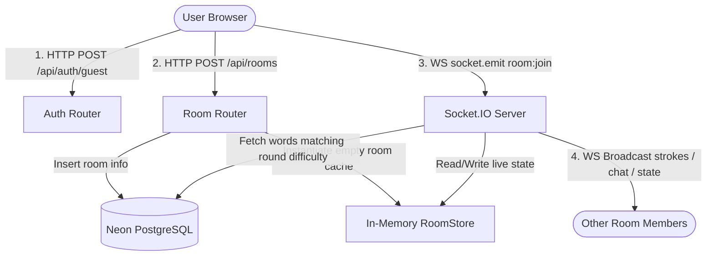

# Doodle.io — Developer Interview & Context Guide 🎨

Welcome back! This document contains everything you need to talk confidently about **Doodle.io** (a multiplayer real-time drawing and guessing game, clone of Skribbl.io) in interviews, as well as a quick warm-up cheat sheet for when you return to the project after a long break.

---

## 🚀 1. Project Overview & Core Tech Stack

Doodle.io is a multiplayer real-time drawing and guessing game. Players join a room via an invite code, take turns drawing words while others guess in real-time chat, accumulate points based on speed, and compete to top the leaderboard.

| Layer | Technology | Rationale |
| :--- | :--- | :--- |
| **Frontend** | **React (Vite)** | Fast HMR (Hot Module Replacement), modular component structure, and responsive layout. |
| **Canvas** | **React-Konva** | Canvas wrapper enabling responsive drawing, stage scaling, and complex shape manipulation. |
| **Real-time** | **Socket.IO** | Bi-directional communication channel with automatic reconnects, room abstraction, and long-polling fallbacks. |
| **Backend** | **Node.js + Express** | Event-driven, non-blocking asynchronous server perfect for high-concurrency I/O chat and socket connections. |
| **Database** | **PostgreSQL (Neon)** | Relational database to persist permanent data (room codes, word banks by round difficulty) reliably. |
| **Caching** | **In-memory store** | Fast RAM object `roomStore` for ephemeral states (players, score arrays, timers, stroke history) to minimize DB load. |
| **Auth** | **JWT (Guest Session)** | Stateless JWT guest tokens to uniquely authenticate users for 24 hours without database-bound friction. |

---

## 🗺️ 2. High-Level System Architecture

Doodle.io splits its data flow logically between HTTP requests (setup/auth) and WebSockets (real-time gameplay mechanics). 



- **HTTP API Layer**: Handles guest login via [authRouter.js](file:///home/viswanathanms/Doodle.io/Backend/routes/authRouter.js) and room instantiation via [room.js](file:///home/viswanathanms/Doodle.io/Backend/routes/room.js).
- **WS Event Handler Layer**: Handles drawing, room joining, chat guesses, and sequential turn logic inside [index.js](file:///home/viswanathanms/Doodle.io/Backend/index.js).
- **Ephemeral State Storage**: The [roomStore.js](file:///home/viswanathanms/Doodle.io/Backend/game/roomStore.js) holds real-time room data (players, scores, timers, strokes, current artist) on backend RAM, ensuring sub-millisecond lookups.

---

## 🔄 3. The Core Game Loop

The server manages a finite state machine for each room code. Below is the transition flow:

```
[ LOBBY (Waiting) ] 
       │  (Min 2 players join)
       ▼
[ WORD SELECTION ] ──(Artist picks word / 10s timeout)──► [ DRAWING (Active Game) ]
       ▲                                                           │
       │                                                           │ (Timer = 0 OR all guess)
       │                                                           ▼
       └─────────── (Intermission / 3s pause) ─────────── [ ROUND INTERMISSION ]
                                                                   │
                                                                   │ (Round > 3)
                                                                   ▼
                                                            [ GAME OVER (Podium) ]
```

1. **`waiting`**: Room waits in lobby mode. As soon as players count $\ge 2$, [roomHandlers.js](file:///home/viswanathanms/Doodle.io/Backend/socket/handler/roomHandlers.js) triggers `startGame`.
2. **`word_selection`**: Artist is assigned sequentially. The backend queries PostgreSQL words bank matching the round's difficulty (`difficulty = round`) and sends 3 words to the artist. The artist has 10 seconds to pick, or the first word is auto-selected.
3. **`playing`**: A 60-second timer begins. The artist draws on [DrawingCanvas.jsx](file:///home/viswanathanms/Doodle.io/Client/src/components/Drawing/DrawingCanvas.jsx) while guessers type in [Chat.jsx](file:///home/viswanathanms/Doodle.io/Client/src/components/Features/Chat.jsx).
4. **`intermission`**: Turn ends, board is cleared, and `artistIndex` is incremented. There is a 3-second intermission before transitioning back to word selection.
5. **`game_over`**: After 3 rounds, the game ends, cleanups are processed, and the final leaderboard/podium displays on [GameRoom.jsx](file:///home/viswanathanms/Doodle.io/Client/src/components/Pages/GameRoom.jsx).

---

## 🧠 4. The "Hard 40%" — Architectural Challenges & Solutions

These are the complex problems solved in Doodle.io. Mentioning these in interviews will show your depth in real-time systems engineering:

### ⚠️ Challenge 1: The React Strict Mode & "Ghost Room" Reconnection Bug
* **The Problem**: In React's development mode, `React.StrictMode` mounts, unmounts, and remounts components instantaneously to detect side effects. During page reloads or strict-mode mount flickers, the client sends `join` $\rightarrow$ `disconnect` $\rightarrow$ `join` in milliseconds. The server processed the disconnect immediately, removing the player from the room list just as they reconnected, placing them in an isolated "ghost room" with stale socket IDs.
* **The Solution (Disconnect Dictionary & Grace Period)**:
  In [roomHandlers.js](file:///home/viswanathanms/Doodle.io/Backend/socket/handler/roomHandlers.js), when a user disconnects, we **do not** delete them immediately. Instead, we put their socket ID inside a global `disconnectTimers` dictionary with a 5-second `setTimeout` grace period. If a reconnection event arrives for that username *before* the 5 seconds fire, we invoke `clearTimeout()`, updating their active `socket.id` and cancelling the deletion.

### ⏱️ Challenge 2: The Javascript Closure Trap (Unstoppable Game Clock)
* **The Problem**: When a guesser successfully guessed the word, the game was supposed to terminate the turn early. However, setting `room.timer = 0` was ignored by the countdown loop, and the clock kept counting down from 59.
* **The Cause**: The backend timer used a JavaScript **closure** inside the `setInterval` block, binding a primitive variable `timeLeft` to local memory.
  ```javascript
  let timeLeft = 60; // Bound inside the local handler scope
  setInterval(() => {
      timeLeft--;
      room.timer = timeLeft;
  }, 1000);
  ```
  Updating `room.timer` from outside files had no effect because the closure was reading/writing to its isolated local `timeLeft` variable.
* **The Solution**: Removed the primitive variable wrapper and modified the timer loop in [gameHandler.js](file:///home/viswanathanms/Doodle.io/Backend/socket/handler/gameHandler.js) to read and decrement directly from the global state reference object (`room.timer--`). Since objects are passed by reference in JavaScript, updating `room.timer = 0` anywhere instantly ends the clock tick on the next interval cycle.

### 🕵️ Challenge 3: Anti-Cheat State Masking (Asymmetric State Broadcast)
* **The Problem**: If the server simply broadcasts the global `room` state to all clients, players can inspect the WebSocket payload in Chrome DevTools (`Network -> WS -> messages`) and see `room.currentWord: "APPLE"`, bypassing the guessing engine.
* **The Solution (State Masking)**:
  Before emitting `room:state` or `game:round_started`, the server intercepts the payload and creates a sanitized cloning reference called `safeRoom`.
  - **For the Artist**: We send the raw `currentWord` and `wordOptions`.
  - **For the Guessers**: We run a server-side regex `room.currentWord.replace(/[a-zA-Z]/g, '_')` and set `wordOptions: null`. The guessers' machines physically never receive the plain-text word, rendering network payload cheating impossible.

### 💬 Challenge 4: Targeted Sockets (Winner's Lounge Chat Segregation)
* **The Problem**: When a guesser guesses the secret word, they shouldn't be allowed to type it in public chat to ruin the round. Instead, correct guessers should enter a separate "Winner's Lounge" chat where they can talk to each other and the artist.
* **The Solution (Bypassing Public Rooms)**:
  We bypassed standard Socket.IO room broadcasts (`io.to(code).emit`) to prevent leakages. Instead, in [chatHandler.js](file:///home/viswanathanms/Doodle.io/Backend/socket/handler/chatHandler.js), we filter the `room.players` array in Node memory. For guessers who have already guessed the word (`player.hasGuessed === true`), we send the message using a loop that emits directly to individual socket IDs (`io.to(player.id).emit(...)`), creating a dynamic sub-chat system.

### 📐 Challenge 5: Scalable & Responsive Multi-Device Canvas
* **The Problem**: Canvas sizes are defined in absolute pixels (`800x600`). If a user on a laptop draws on an `800x600` board, a user on a mobile device with a `400px` screen will have their canvas cut in half, or drawing strokes will be physically displaced.
* **The Solution (Coordinate Scale Normalization)**:
  In [DrawingCanvas.jsx](file:///home/viswanathanms/Doodle.io/Client/src/components/Drawing/DrawingCanvas.jsx), we normalise the coordinate system:
  1. We compute a scale factor based on the container width: `scale = parentWidth / 800`.
  2. When drawing, we divide the coordinates of the mouse click by the scale factor before emitting them to the server: `points: [pos.x / scale, pos.y / scale]`.
  3. When rendering on the other clients' screens, Konva applies the scale factor back to scale up the coordinates dynamically: `scaleX={scale} scaleY={scale}`.
  This allows seamless cross-platform drawings regardless of screen resolution.

---

## ⚡ 5. Developer Interview Prep Sheet (Q&A)

Here are the questions an interviewer is likely to ask about this architecture:

### Q1: Why did you store game states in-memory (`roomStore`) instead of Redis or PostgreSQL?
> **Answer**: PostgreSQL is a relational database designed for persistent, transactional storage. Writing canvas strokes (which emit 60 times a second) or timer ticks to PG would quickly overwhelm connection pools and cause I/O bottlenecks. An in-memory JavaScript object (`roomStore`) offers sub-millisecond reads/writes with zero overhead. While Redis is ideal for scaling horizontally, storing state in-memory was the most performant choice for our MVP architecture.

### Q2: How would you scale this application to support 50,000 concurrent players?
> **Answer**: Scaling this architecture would involve two major changes:
> 1. **Horizontal Scaling of Socket Server**: Spin up multiple backend instances behind a Load Balancer (using sticky sessions, since WebSockets require a persistent handshake connection).
> 2. **Redis Adapter for Socket.IO**: Replace the local in-memory `roomStore` with a shared Redis cache or a Socket.IO Redis Adapter. This ensures that if Player A is connected to Server 1 and Player B is connected to Server 2, their drawing strokes are published/subscribed across both instances instantly.

### Q3: What is the benefit of Socket.IO over pure WebSockets (ws)?
> **Answer**: Socket.IO provides features out of the box that `ws` lacks:
> - **Fallback to HTTP Long-Polling**: If corporate firewalls block WebSocket connections, Socket.IO gracefully degrades to HTTP polling.
> - **Connection Management**: It automatically handles disconnections and client reconnection attempts.
> - **Room Abstraction**: Built-in room grouping (`socket.join`) simplifies broadcasting to specific games.

### Q4: How is security handled on guest sessions?
> **Answer**: When a user registers a guest session, the server issues a stateless JWT containing the `userId`, `username`, and `color`, signed by a server-side secret key. When the player requests to create a room or connects via Socket.IO, we verify the JWT. During gameplay, the server controls the authoritative game loop—validating correct guesses, filtering secret words, and verifying whether a client is authorized to draw before broadcasting their strokes.

---

## 🏃 6. Quick-Start Context Warm-up

If you've been away for a long day and need to get back in the zone, read this checklist:

### 1. File Reference Directory
* **Frontend Core**: [App.jsx](file:///home/viswanathanms/Doodle.io/Client/src/App.jsx) (Router), [GameRoom.jsx](file:///home/viswanathanms/Doodle.io/Client/src/components/Pages/GameRoom.jsx) (Active Game UI/State Listener), [DrawingCanvas.jsx](file:///home/viswanathanms/Doodle.io/Client/src/components/Drawing/DrawingCanvas.jsx) (Konva stage).
* **Backend Core**: [index.js](file:///home/viswanathanms/Doodle.io/Backend/index.js) (Express & Sockets initialization), [roomStore.js](file:///home/viswanathanms/Doodle.io/Backend/game/roomStore.js) (RAM Cache).
* **Socket Handlers**: [roomHandlers.js](file:///home/viswanathanms/Doodle.io/Backend/socket/handler/roomHandlers.js) (Connection / Reconnect Grace Period), [gameHandler.js](file:///home/viswanathanms/Doodle.io/Backend/socket/handler/gameHandler.js) (Timers & Turn Loop), [chatHandler.js](file:///home/viswanathanms/Doodle.io/Backend/socket/handler/chatHandler.js) (Guess verification & private routing).

### 2. Testing Your Changes Locally
1. Start the backend:
   ```bash
   cd Backend
   npm run dev
   ```
2. Start the frontend:
   ```bash
   cd Client
   npm run dev
   ```
3. Open two separate browser tabs in incognito mode at `http://localhost:5173`.
4. Enter usernames in both, copy the invite code from one, and join from the other.
5. Draw on the screen and verify strokes sync instantly.
6. Guess the word in chat in the second tab and verify points accumulate.
